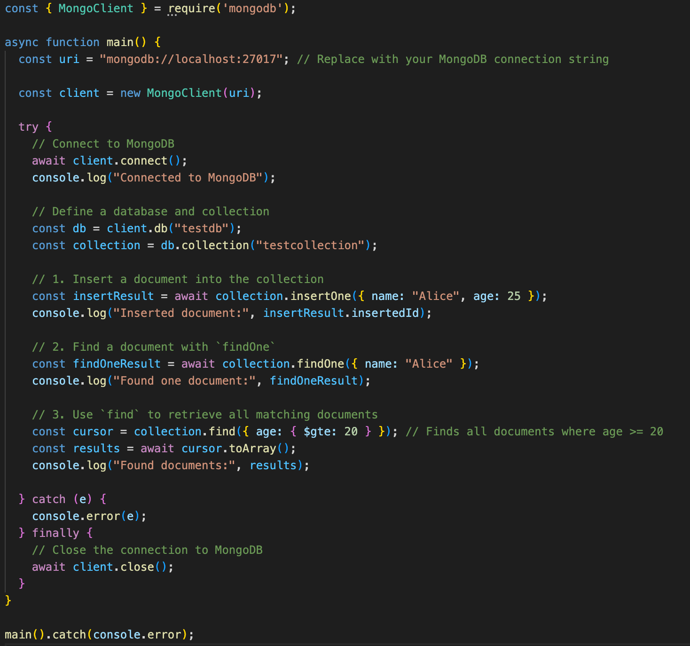
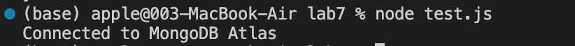

### 5610_Lab 7 - MongoDB

> **MongoDB**

The objective of this lab is to gain hands-on experience in setting up
and using MongoDB Atlas, a cloud-based database platform. You will learn
how to install MongoDB, create a database cluster in Atlas, and connect
to it using Node.js.

### Step 1: Download MongoDB

1.  Go to the MongoDB Download Page**:**
    <https://www.mongodb.com/try/download/community>

2.  Under the Platform dropdown, choose Windows. Make sure the Package
    is set to MSI.

3.  Click Download to get the latest MongoDB Community Edition installer
    (msi file).

4.  After the download is complete, open the .msi file to start the
    installation.

5.  Follow the prompts in the Setup Wizard.

6.  Choose **Complete Setup** (this installs all MongoDB features).

7.  Install MongoDB as a Service

8.  Continue through the Setup Wizard and complete the installation.

9.  By default, MongoDB uses C:\\data\\db as the directory to store its
    data.

    -   Open **File Explorer** and go to your C: drive.

    -   Manually create a new folder called data in the C: drive.

    -   Inside the data folder, create another folder called db. The
        path should now look like this: C:\\data\\db. This is where
        MongoDB will store its databases.

### Start MongoDB Service. Open Command prompt and type the following command and press **Enter** *net start MongoDB.* 

### This will start the MongoDB server as a Windows service. If MongoDB has been installed correctly, you should see a message like:

> *The MongoDB service was started successfully.*

11. Connect to MongoDB. In the connection dialog, you can connect to
    your local MongoDB instance by using the default connection string:
    mongodb://localhost:27017. This will connect you to your MongoDB
    server running on your local machine.

12. Explore Databases and Collections:

    -   Once connected, you will be able to see the list of databases.
        You can click on any database to explore its collections.

    -   Use the \"Create Database\" option to add new databases or
        collections.

    -   In the Collections tab, you can run MongoDB queries using the
        Filter bar to query documents. You can also run aggregation
        queries in the Aggregation tab.

    -   You can manually add documents using the Insert Document button.

    -   To edit existing documents, use the Update Document button or
        directly edit fields.

    -   Delete documents by selecting them and clicking the Delete
        button.

### Use MongoDB with Node.js. Now that MongoDB is installed and running, you can integrate it with Node.js**.** Install the MongoDB Node.js Driver**. Create Lab7 and open in VSCode.** Run the following command to install the MongoDB Node.js driver:

> *npm install mongodb.*

The \"dependencies\" field in package.json will have a line added for
\"mongodb\".

For macOS

Automatic Installation (Recommended)

-   You can use Homebrew for a simple installation. Run the following
    command:

> [brew install mongodb-community@6.0]{.underline}

**ACTIVITY 1**

1.  Copy the code into script.js

2.  Run [node script.js]{.underline} to execute the script and observe
    the functions of insertOne, findOne, and find. *node script.js*

3.  You can see the data in MongoDB Compass.

Activity 2 - MongoDB Atlas

MongoDB Atlas is a fully managed, cloud-based database platform that
allows you to access your database from anywhere with an internet
connection, eliminating the need for local installations. It offers a
**free tier (M0 Sandbox)** with up to 512MB of storage, making it
perfect for learning and experimenting at no cost. You can create
clusters and perform basic **CRUD operations** just like on a local
MongoDB instance, but now from the cloud. Using MongoDB Atlas provides
real-world experience, as most modern applications rely on cloud
databases.

1.  **Register a MongoDB Atlas account**.\
    Go to
    [[https://www.mongodb.com/products/platform/atlas-database]{.underline}](https://www.mongodb.com/products/platform/atlas-database)

Click the \"Try Free\" button, and sign up for a free account using your
email or Google account.

2.  **Create a database cluster**.

Click the \"Create new\" button to create a cluster. Choose a free
cluster (usually **M0 Sandbox**), and select a suitable region
(preferably the one closest to you). Click \"Create Cluster\" and wait a
few minutes for the cluster to be created.

3.  **Set up database user and IP access permissions**\
    Click \"Database Access\" on the left, then click \"Add New Database
    User\" to create a username and password, which will be used to
    connect to the database from your application.

In the \"Network Access\" tab, click \"Add IP Address\" and choose \"Add
current IP address\". You can choose to allow access from your current
IP address or allow access from anywhere (by adding 0.0.0.0/0 in IP
whitelist). For security, restricting to your current IP is recommended
unless working in a collaborative project.

4.  **Connect to MongoDB Atlas using Compass**\
    Go back to the overview page and click the \"Connect\" button, then
    select \"Compass\". You will see a connection string similar to:\
    [mongodb+srv://ln541758:\<db_password\>@kanbas.9ijmjtl.mongodb.net/.]{.underline}

After opening Compass, click the \"+\" button next to \"connections\".
In the URI field, paste the connection string copied from Atlas, and
remember to replace it with the username and password you created in
Step 3.

5.  Connect to MongoDB Atlas through the application\
    Make sure you have installed the MongoDB driver in your Node.js
    environment before (*[npm install mongodb]{.underline}).* Use the
    code to connect to Atlas and save the code in a file called test.js.

In the code, replace \<username\> and \<password\> with the username and
password you created in Atlas.

6.  Run the code: [node test.js]{.underline}

ACTIVITY 3 - CRUD Activity: Task Manager Application

Create a Node.js application that performs **Create, Read, Update, and
Delete (CRUD)** operations on a MongoDB Atlas database. You will connect
to your MongoDB Atlas cluster and interact with a collection to manage
tasks.

1.  Ensure you are connected to MongoDB Atlas. In your cluster, create a
    new database called **taskManagerDB** and a collection called
    **tasks**.

2.  Create a new Node.js file in your project directory called
    **taskManager.js.** Add comments to your code explaining the purpose
    of each operation.

3.  In taskManager.js, write code to connect to MongoDB Atlas.

    -   Insert a new task into the tasks collection with the following
        fields:

        -   title (string): A short title for the task.

        -   description (string): A detailed description of the task.

        -   completed (boolean): Whether the task is completed (false by
            default).

        -   dueDate (string): The due date of the task in YYYY-MM-DD
            format.

> {
>
> \"title\": \"Complete MongoDB CRUD activity\",
>
> \"description\": \"Write a Node.js script that performs CRUD
>
> operations in MongoDB Atlas\",
>
> \"completed\": false,
>
> \"dueDate\": \"2024-11-15\"
>
> }
>
> Add **three** tasks to the task collection.

4.  Query the tasks collection to **retrieve all tasks** and print them
    to the console. Make sure you display the tasks in a readable
    format.

5.  Update one task by setting its completed status to true. You can
    update the task you inserted in the previous step.

6.  Delete a task from the tasks collection based on its title or
    another identifier.

7.  Run the script to execute the CRUD operations.

8.  Use MongoDB Compass to verify that the tasks were inserted, updated,
    and deleted as expected.

-   Now, modify code to handle multiple tasks at once by inserting an
    array of tasks.

-   Query and print tasks that are due in the future (based on dueDate).

### 

### Deliverables:

-   Submit your taskManager.js script that performs the CRUD operations.

